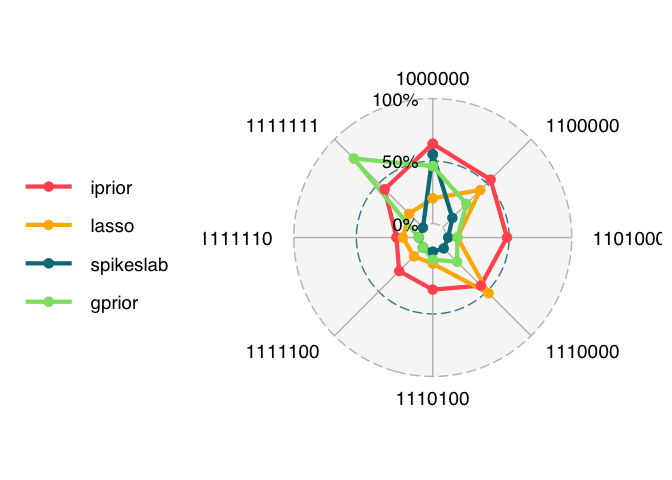

I-priors and interactions
================

This contains the R code for our paper.

> Wicher Bergsma, Haziq Jamil (2022). *Additive interaction modelling
> using I-priors*.

The key documents are

1.  `02-sims.R` and `03-sims_analysis.R` contains the code for the
    simulations in Section 5.
2.  `01-cow.R` contains the code for the functional response model in
    Section 6.

In this README, the main summary of findings are presented.

## Simulations

Data pairs $(y_i,x_i)$, where $x_i\in\mathbb R^3$ for $i=1,\dots,n$,
were simulated according to the following model

$$ y_i = \beta_1 x\_{i1} + \beta_2 x\_{i2} + \beta_3 x\_{i3} + \beta_4
x\_{i1}x\_{i2} + \beta_5 x\_{i1}x\_{i3} + \beta_6 x\_{i2}x\_{i3} +
\beta_7 x\_{i1}x\_{i2}x\_{i3} + \epsilon_i $$

where $\epsilon_i\sim N(0,\sigma^2)$ such that
$\text{Corr}(\epsilon_i,\epsilon_j)=\rho$, for $i\neq j$. The simulation
settings were $n=100$, $\sigma=3$, $\rho\in\\{0,0.5\\}$. The
coefficients were varied according to the table below

|     |  x1 |  x2 |  x3 | x1x2 | x1x3 | x2x3 | x1x2x3 | code    |
|:----|----:|----:|----:|-----:|-----:|-----:|-------:|:--------|
| 1   |   1 |   0 |   0 |  0.0 |  0.0 |  0.0 |   0.00 | 1000000 |
| 2   |   1 |   1 |   0 |  0.0 |  0.0 |  0.0 |   0.00 | 1100000 |
| 3   |   1 |   1 |   0 |  0.5 |  0.0 |  0.0 |   0.00 | 1101000 |
| 4   |   1 |   1 |   1 |  0.0 |  0.0 |  0.0 |   0.00 | 1110000 |
| 5   |   1 |   1 |   1 |  0.0 |  0.5 |  0.0 |   0.00 | 1110100 |
| 6   |   1 |   1 |   1 |  0.5 |  0.5 |  0.0 |   0.00 | 1111100 |
| 7   |   1 |   1 |   1 |  0.5 |  0.5 |  0.5 |   0.00 | 1111110 |
| 8   |   1 |   1 |   1 |  0.5 |  0.5 |  0.5 |   0.25 | 1111111 |

For each set of true values of the coefficients, the four methods
proposed the likeliest model to have generated the data set, from a
search of hierarchically nested interaction models. This was replicated
a total of $B=10,000$ times for each true value set.

The results below show proportion of times that each method selected the
true model (higher is better).

### Uncorrelated errors

<!-- -->

|     | mod     | iprior | lasso | spikeslab | gprior |
|:----|:--------|-------:|------:|----------:|-------:|
| 1   | 1000000 |   0.69 |  0.21 |      0.60 |   0.46 |
| 2   | 1100000 |   0.54 |  0.33 |      0.49 |   0.29 |
| 3   | 1101000 |   0.52 |  0.11 |      0.15 |   0.04 |
| 4   | 1110000 |   0.33 |  0.36 |      0.43 |   0.13 |
| 5   | 1110100 |   0.33 |  0.15 |      0.17 |   0.01 |
| 6   | 1111100 |   0.27 |  0.10 |      0.08 |   0.00 |
| 7   | 1111110 |   0.15 |  0.09 |      0.06 |   0.00 |
| 8   | 1111111 |   0.18 |  0.06 |      0.09 |   0.98 |

The geometric mean

|           |    x |
|:----------|-----:|
| iprior    | 0.33 |
| lasso     | 0.15 |
| spikeslab | 0.19 |
| gprior    | 0.21 |

### Correlated errors

<!-- -->

|     | mod     | iprior | lasso | spikeslab | gprior |
|:----|:--------|-------:|------:|----------:|-------:|
| 1   | 1000000 |   0.63 |  0.20 |      0.59 |   0.45 |
| 2   | 1100000 |   0.55 |  0.43 |      0.24 |   0.27 |
| 3   | 1101000 |   0.48 |  0.08 |      0.14 |   0.09 |
| 4   | 1110000 |   0.44 |  0.51 |      0.13 |   0.16 |
| 5   | 1110100 |   0.31 |  0.10 |      0.11 |   0.07 |
| 6   | 1111100 |   0.28 |  0.11 |      0.02 |   0.00 |
| 7   | 1111110 |   0.17 |  0.12 |      0.01 |   0.00 |
| 8   | 1111111 |   0.43 |  0.15 |      0.06 |   0.77 |

The geometric mean

|           |    x |
|:----------|-----:|
| iprior    | 0.38 |
| lasso     | 0.17 |
| spikeslab | 0.08 |
| gprior    | 0.14 |

## Functional response model

<!-- -->
