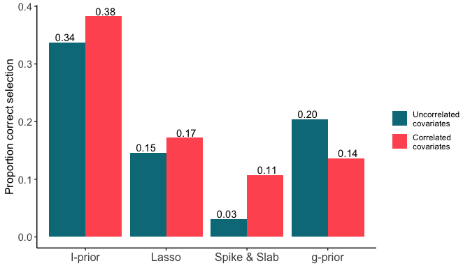

I-priors and interactions
================

This contains the R code for our paper.

> Wicher Bergsma, Haziq Jamil (2023). *Additive interaction modelling
> using I-priors*.

The key documents are as follows.

1.  [`02-sims.R`](02-sims.R) and
    [`03-sims_analysis.R`](03-sims_analysis.R) contain the code for the
    simulations study detailed in Section 5 of the manuscript.
2.  [`01-cow.R`](%6001-cow.R%60) contains the code for the functional
    response model in the application section (Section 6) of the
    manuscript.

In this README, the main summary of findings are presented. Full details
of the simulation results are found in the pdf files
[`simres_corr.pdf`](%60simres_corr.pdf%60) and
[`simres_uncorr.pdf`](%60simres_uncorr.pdf%60).

Please install the developmental version of the
[`{iprior}`](https://github.com/haziqj/iprior) package.

## Simulation study

Data pairs $(y_i,x_i)$, where $x_i\in\mathbb R^3$ for $i=1,\dots,n$,
were simulated according to the following model

$$
y_i = \beta_1 x_{i1} + \beta_2 x_{i2} + \beta_3 x_{i3} + \beta_4 x_{i1}x_{i2} + \beta_5 x_{i1}x_{i3} + \beta_6 x_{i2}x_{i3} + \beta_7 x_{i1}x_{i2}x_{i3} + \epsilon_i
$$

where $\epsilon_i\sim N(0,\sigma^2)$ such that
$\operatorname{Corr}(x_{ij},x_{ik})=\rho$, for $j\neq k$. The simulation
settings were $n=100$, $\sigma=3$, and $\rho\in\{0,0.5\}$. The
coefficients were varied according to the table below

|     |  x1 |  x2 |  x3 | x1x2 | x1x3 | x2x3 | x1x2x3 | code    |
|:----|----:|----:|----:|-----:|-----:|-----:|-------:|:--------|
| 1   |   1 |   0 |   0 |  0.0 |  0.0 |  0.0 |   0.00 | 1000000 |
| 2   |   1 |   1 |   0 |  0.0 |  0.0 |  0.0 |   0.00 | 1100000 |
| 3   |   1 |   1 |   0 |  0.5 |  0.0 |  0.0 |   0.00 | 1101000 |
| 4   |   1 |   1 |   1 |  0.0 |  0.0 |  0.0 |   0.00 | 1110000 |
| 5   |   1 |   1 |   1 |  0.0 |  0.5 |  0.0 |   0.00 | 1110100 |
| 6   |   1 |   1 |   1 |  0.5 |  0.5 |  0.0 |   0.00 | 1111100 |
| 7   |   1 |   1 |   1 |  0.5 |  0.5 |  0.5 |   0.00 | 1111110 |
| 8   |   1 |   1 |   1 |  0.5 |  0.5 |  0.5 |   0.25 | 1111111 |

For each set of true values of the coefficients, the four methods
proposed the likeliest model to have generated the data set, from a
search of hierarchically nested interaction models. This was replicated
a total of $B=10,000$ times for each true value set.

The results below show proportion of times that each method selected the
true model (higher is better).

### Uncorrelated errors

<!-- -->

|     | mod     | iprior | lasso | spikeslab | gprior |
|:----|:--------|-------:|------:|----------:|-------:|
| 1   | 1000000 |   0.69 |  0.21 |      0.56 |   0.45 |
| 2   | 1100000 |   0.55 |  0.33 |      0.32 |   0.29 |
| 3   | 1101000 |   0.52 |  0.11 |      0.02 |   0.04 |
| 4   | 1110000 |   0.33 |  0.37 |      0.18 |   0.13 |
| 5   | 1110100 |   0.32 |  0.15 |      0.01 |   0.01 |
| 6   | 1111100 |   0.26 |  0.09 |      0.00 |   0.00 |
| 7   | 1111110 |   0.16 |  0.08 |      0.00 |   0.00 |
| 8   | 1111111 |   0.19 |  0.06 |      0.00 |   0.98 |

<!-- The geometric mean -->
<!-- ```{r} -->
<!-- res_tab2[, -1] %>%  -->
<!--   apply(., 2, function(x) exp(sum(log(x[x > 0])) / length(x))) %>% -->
<!--   round(3) -->
<!-- ``` -->

### Correlated errors

<!-- -->

|     | mod     | iprior | lasso | spikeslab | gprior |
|:----|:--------|-------:|------:|----------:|-------:|
| 1   | 1000000 |   0.64 |  0.20 |      0.55 |   0.46 |
| 2   | 1100000 |   0.54 |  0.43 |      0.11 |   0.27 |
| 3   | 1101000 |   0.48 |  0.09 |      0.01 |   0.09 |
| 4   | 1110000 |   0.43 |  0.52 |      0.01 |   0.16 |
| 5   | 1110100 |   0.31 |  0.10 |      0.00 |   0.07 |
| 6   | 1111100 |   0.27 |  0.10 |      0.00 |   0.00 |
| 7   | 1111110 |   0.18 |  0.13 |      0.00 |   0.00 |
| 8   | 1111111 |   0.43 |  0.16 |      0.00 |   0.78 |

<!-- The geometric mean -->
<!-- ```{r} -->
<!-- res_tab1[, -1] %>%  -->
<!--   apply(., 2, function(x) exp(sum(log(x[x > 0])) / length(x))) %>% -->
<!--   round(3) -->
<!-- ``` -->

### Summary of results

<!-- -->

## Functional response model

<!-- -->

The model fitted was an I-prior model with ANOVA kernel (Pearson & fBm).
The results are tabulated below.

### Fixed hurst = 0.5

| model | formula               |   loglik | error | lambda               | psi     | hurst |   k |     AIC |     BIC |
|------:|:----------------------|---------:|------:|:---------------------|:--------|------:|----:|--------:|--------:|
|     1 | `time`                | -2789.23 | 16.25 | 0.837                | 0.00375 |   0.5 |   2 | 5582.46 | 5591.45 |
|     2 | `group * time`        | -2789.20 | 16.24 | 0.019,-0.836         | 0.00375 |   0.5 |   3 | 5584.40 | 5597.88 |
|     3 | `id * time`           | -2295.16 |  2.89 | -0.203,-0.088        | 0.07384 |   0.5 |   3 | 4596.33 | 4609.81 |
|     4 | `(group + id) * time` | -2270.85 |  2.62 | -1.019,-0.187,-0.085 | 0.08711 |   0.5 |   4 | 4549.70 | 4567.67 |
|     5 | `group * id * time`   | -2249.00 |  3.09 | -1.057,4.918,0.047   | 0.06538 |   0.5 |   4 | 4506.00 | 4523.97 |

### Fixed hurst = 0.3

| model | formula               |   loglik | error | lambda              | psi     | hurst |   k |     AIC |     BIC |
|------:|:----------------------|---------:|------:|:--------------------|:--------|------:|----:|--------:|--------:|
|     1 | `time`                | -2792.78 | 16.22 | 4.465               | 0.00375 |   0.3 |   2 | 5589.56 | 5598.54 |
|     2 | `group * time`        | -2792.73 | 16.20 | 0.03,-4.462         | 0.00376 |   0.3 |   3 | 5591.47 | 5604.94 |
|     3 | `id * time`           | -2266.39 |  1.62 | -0.163,-0.381       | 0.13445 |   0.3 |   3 | 4538.79 | 4552.26 |
|     4 | `(group + id) * time` | -2242.30 |  1.44 | 0.708,-0.152,-0.36  | 0.15896 |   0.3 |   4 | 4492.60 | 4510.57 |
|     5 | `group * id * time`   | -2238.78 |  2.16 | -1.184,-1.265,0.248 | 0.09450 |   0.3 |   4 | 4485.56 | 4503.53 |

### Estimated hurst value

| model | formula               |   loglik | error | lambda            | psi     | hurst |   k |     AIC |     BIC |
|------:|:----------------------|---------:|------:|:------------------|:--------|------:|----:|--------:|--------:|
|     1 | `time`                | -2788.77 | 16.28 | 0.347             | 0.00374 |  0.62 |   3 | 5583.53 | 5597.01 |
|     2 | `group * time`        | -2788.75 | 16.27 | 0.013,-0.35       | 0.00375 |  0.61 |   4 | 5585.49 | 5603.46 |
|     3 | `id * time`           | -2253.21 |  0.16 | -0.065,0.83       | 1.24112 |  0.17 |   4 | 4514.43 | 4532.40 |
|     4 | `(group + id) * time` | -2231.13 |  0.13 | 0.102,0.058,0.745 | 1.59394 |  0.18 |   5 | 4472.27 | 4494.73 |
|     5 | `group * id * time`   | -2232.78 |  0.18 | 0.11,0.058,0.751  | 1.19639 |  0.18 |   5 | 4475.55 | 4498.01 |

## Outro

    ## ─ Session info ───────────────────────────────────────────────────────────────
    ##  setting  value
    ##  version  R version 4.2.3 (2023-03-15)
    ##  os       macOS Big Sur ... 10.16
    ##  system   x86_64, darwin17.0
    ##  ui       X11
    ##  language (EN)
    ##  collate  en_US.UTF-8
    ##  ctype    en_US.UTF-8
    ##  tz       Asia/Brunei
    ##  date     2023-05-01
    ##  pandoc   3.1.1 @ /Applications/RStudio.app/Contents/Resources/app/quarto/bin/tools/ (via rmarkdown)
    ## 
    ## ─ Packages ───────────────────────────────────────────────────────────────────
    ##  package     * version date (UTC) lib source
    ##  BAS         * 1.6.4   2022-11-02 [1] CRAN (R 4.2.0)
    ##  cellranger    1.1.0   2016-07-27 [1] CRAN (R 4.2.0)
    ##  cli           3.6.1   2023-03-23 [1] CRAN (R 4.2.0)
    ##  coda          0.19-4  2020-09-30 [1] CRAN (R 4.2.0)
    ##  codetools     0.2-19  2023-02-01 [1] CRAN (R 4.2.3)
    ##  colorspace    2.1-0   2023-01-23 [1] CRAN (R 4.2.0)
    ##  digest        0.6.31  2022-12-11 [1] CRAN (R 4.2.0)
    ##  doSNOW      * 1.0.20  2022-02-04 [1] CRAN (R 4.2.0)
    ##  dplyr       * 1.1.1   2023-03-22 [1] CRAN (R 4.2.0)
    ##  evaluate      0.20    2023-01-17 [1] CRAN (R 4.2.0)
    ##  fansi         1.0.4   2023-01-22 [1] CRAN (R 4.2.0)
    ##  farver        2.1.1   2022-07-06 [1] CRAN (R 4.2.0)
    ##  fastmap       1.1.1   2023-02-24 [1] CRAN (R 4.2.0)
    ##  forcats     * 1.0.0   2023-01-29 [1] CRAN (R 4.2.0)
    ##  foreach     * 1.5.2   2022-02-02 [1] CRAN (R 4.2.0)
    ##  generics      0.1.3   2022-07-05 [1] CRAN (R 4.2.0)
    ##  ggplot2     * 3.4.2   2023-04-03 [1] CRAN (R 4.2.0)
    ##  ggradar     * 0.2     2023-05-01 [1] Github (ricardo-bion/ggradar@53404a5)
    ##  glinternet  * 1.0.12  2021-09-03 [1] CRAN (R 4.2.0)
    ##  glmnet      * 4.1-7   2023-03-23 [1] CRAN (R 4.2.0)
    ##  glue          1.6.2   2022-02-24 [1] CRAN (R 4.2.0)
    ##  gtable        0.3.3   2023-03-21 [1] CRAN (R 4.2.0)
    ##  highr         0.10    2022-12-22 [1] CRAN (R 4.2.0)
    ##  hms           1.1.3   2023-03-21 [1] CRAN (R 4.2.0)
    ##  htmltools     0.5.5   2023-03-23 [1] CRAN (R 4.2.0)
    ##  httr          1.4.5   2023-02-24 [1] CRAN (R 4.2.0)
    ##  iprior      * 0.7.3   2019-03-20 [1] CRAN (R 4.2.0)
    ##  ipriorBVS   * 0.1.1   2023-05-01 [1] Github (haziqj/ipriorBVS@2a506cc)
    ##  iterators   * 1.0.14  2022-02-05 [1] CRAN (R 4.2.0)
    ##  kableExtra  * 1.3.4   2021-02-20 [1] CRAN (R 4.2.0)
    ##  knitr         1.42    2023-01-25 [1] CRAN (R 4.2.0)
    ##  labeling      0.4.2   2020-10-20 [1] CRAN (R 4.2.0)
    ##  lattice       0.20-45 2021-09-22 [1] CRAN (R 4.2.3)
    ##  lifecycle     1.0.3   2022-10-07 [1] CRAN (R 4.2.0)
    ##  lubridate   * 1.9.2   2023-02-10 [1] CRAN (R 4.2.0)
    ##  magrittr      2.0.3   2022-03-30 [1] CRAN (R 4.2.0)
    ##  Matrix      * 1.5-3   2022-11-11 [1] CRAN (R 4.2.3)
    ##  munsell       0.5.0   2018-06-12 [1] CRAN (R 4.2.0)
    ##  pillar        1.9.0   2023-03-22 [1] CRAN (R 4.2.0)
    ##  pkgconfig     2.0.3   2019-09-22 [1] CRAN (R 4.2.0)
    ##  purrr       * 1.0.1   2023-01-10 [1] CRAN (R 4.2.0)
    ##  R6            2.5.1   2021-08-19 [1] CRAN (R 4.2.0)
    ##  Rcpp          1.0.10  2023-01-22 [1] CRAN (R 4.2.0)
    ##  readr       * 2.1.4   2023-02-10 [1] CRAN (R 4.2.0)
    ##  readxl        1.4.2   2023-02-09 [1] CRAN (R 4.2.0)
    ##  rjags         4-14    2023-04-23 [1] CRAN (R 4.2.0)
    ##  rlang         1.1.0   2023-03-14 [1] CRAN (R 4.2.0)
    ##  rmarkdown     2.21    2023-03-26 [1] CRAN (R 4.2.0)
    ##  rstudioapi    0.14    2022-08-22 [1] CRAN (R 4.2.0)
    ##  runjags       2.2.1-7 2022-04-15 [1] CRAN (R 4.2.0)
    ##  rvest         1.0.3   2022-08-19 [1] CRAN (R 4.2.0)
    ##  scales        1.2.1   2022-08-20 [1] CRAN (R 4.2.0)
    ##  sessioninfo   1.2.2   2021-12-06 [1] CRAN (R 4.2.0)
    ##  shape         1.4.6   2021-05-19 [1] CRAN (R 4.2.0)
    ##  snow        * 0.4-4   2021-10-27 [1] CRAN (R 4.2.0)
    ##  stringi       1.7.12  2023-01-11 [1] CRAN (R 4.2.0)
    ##  stringr     * 1.5.0   2022-12-02 [1] CRAN (R 4.2.0)
    ##  survival      3.5-3   2023-02-12 [1] CRAN (R 4.2.3)
    ##  svglite       2.1.1   2023-01-10 [1] CRAN (R 4.2.0)
    ##  systemfonts   1.0.4   2022-02-11 [1] CRAN (R 4.2.0)
    ##  tibble      * 3.2.1   2023-03-20 [1] CRAN (R 4.2.0)
    ##  tidyr       * 1.3.0   2023-01-24 [1] CRAN (R 4.2.0)
    ##  tidyselect    1.2.0   2022-10-10 [1] CRAN (R 4.2.0)
    ##  tidyverse   * 2.0.0   2023-02-22 [1] CRAN (R 4.2.0)
    ##  timechange    0.2.0   2023-01-11 [1] CRAN (R 4.2.0)
    ##  tzdb          0.3.0   2022-03-28 [1] CRAN (R 4.2.0)
    ##  utf8          1.2.3   2023-01-31 [1] CRAN (R 4.2.0)
    ##  vctrs         0.6.1   2023-03-22 [1] CRAN (R 4.2.0)
    ##  viridisLite   0.4.1   2022-08-22 [1] CRAN (R 4.2.0)
    ##  webshot       0.5.4   2022-09-26 [1] CRAN (R 4.2.0)
    ##  withr         2.5.0   2022-03-03 [1] CRAN (R 4.2.0)
    ##  xfun          0.38    2023-03-24 [1] CRAN (R 4.2.0)
    ##  xml2          1.3.3   2021-11-30 [1] CRAN (R 4.2.0)
    ##  yaml          2.3.7   2023-01-23 [1] CRAN (R 4.2.0)
    ## 
    ##  [1] /Library/Frameworks/R.framework/Versions/4.2/Resources/library
    ## 
    ## ──────────────────────────────────────────────────────────────────────────────
